# rcss_cluster 项目汇报

本文档深入分析 `rcss_cluster` 仓库的代码结构，并通过 Mermaid 图示清晰呈现各部分设计。

---

## 目录

1. [项目概述](#1-项目概述)
2. [整体架构](#2-整体架构)
3. [Server 模块](#3-server-模块)
4. [Service 层](#4-service-层)
5. [Process 进程管理](#5-process-进程管理)
6. [Common 公共库](#6-common-公共库)
7. [Match Composer Sidecar](#7-match-composer-sidecar)
8. [部署架构（Kubernetes / Agones）](#8-部署架构kubernetes--agones)
9. [综合全图](#9-综合全图)

---

## 1. 项目概述

`rcss_cluster` 是一个基于 Rust 的分布式管理系统，为 **RoboCup Soccer Simulator**（`rcssserver`）提供集群化运行能力。它通过 **Agones** 与 Kubernetes 集成，实现游戏服务器的弹性扩缩容和生命周期管理。

工作空间由六个 crate 组成：

| Crate | 职责 |
|---|---|
| `server` | HTTP / WebSocket / UDP 后端服务器 |
| `service` | 服务抽象层（Standalone / Agones） |
| `process` | `rcssserver` 子进程管理 |
| `common` | 共享库（客户端、命令、类型、UDP） |
| `client` | （预留客户端 crate） |
| `sidecars/match_composer` | 比赛编排 Sidecar，管理双方球队进程 |

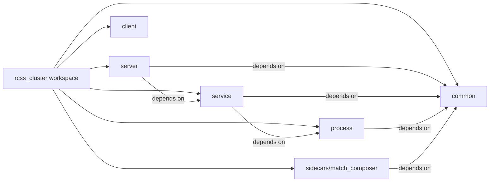
```mermaid
graph LR
    A[rcss_cluster workspace] --> B[server]
    A --> C[service]
    A --> D[process]
    A --> E[common]
    A --> F[client]
    A --> G[sidecars/match_composer]

    B -->|depends on| C
    B -->|depends on| E
    C -->|depends on| D
    C -->|depends on| E
    D -->|depends on| E
    G -->|depends on| E
```

---

## 2. 整体架构

系统从外部客户端到 `rcssserver` 进程的完整数据链路如下：

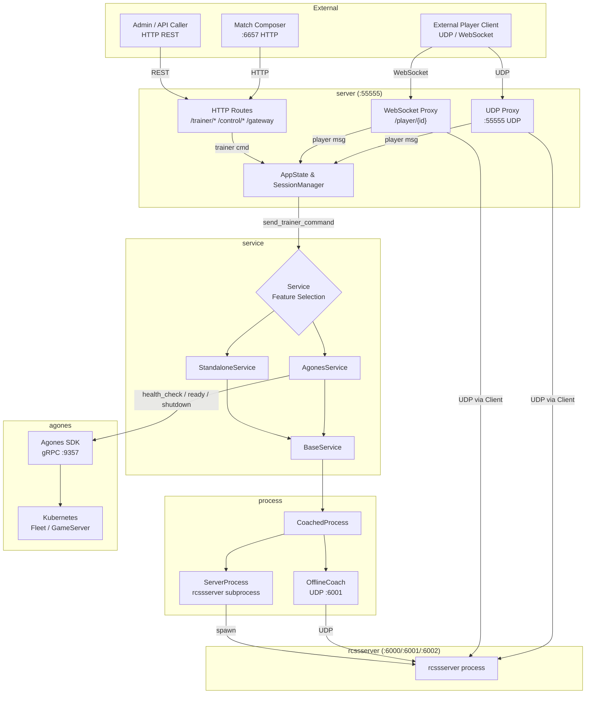
```mermaid
graph TB
    subgraph ext["External"]
        PC["External Player Client\nUDP / WebSocket"]
        AC["Admin / API Caller\nHTTP REST"]
        MC["Match Composer\n:6657 HTTP"]
    end

    subgraph srv["server (:55555)"]
        HTTP["HTTP Routes\n/trainer/* /control/* /gateway"]
        WSP["WebSocket Proxy\n/player/{id}"]
        UDPP["UDP Proxy\n:55555 UDP"]
        SS["AppState & SessionManager"]
    end

    subgraph svc["service"]
        SVC{"Service\nFeature Selection"}
        SA["StandaloneService"]
        AOS["AgonesService"]
        BS["BaseService"]
    end

    subgraph proc["process"]
        CP["CoachedProcess"]
        SP["ServerProcess\nrcssserver subprocess"]
        OC["OfflineCoach\nUDP :6001"]
    end

    subgraph rcss_grp["rcssserver (:6000/:6001/:6002)"]
        RCSS["rcssserver process"]
    end

    subgraph agones_grp["agones"]
        SDK["Agones SDK\ngRPC :9357"]
        K8S["Kubernetes\nFleet / GameServer"]
    end

    AC -->|REST| HTTP
    PC -->|WebSocket| WSP
    PC -->|UDP| UDPP
    MC -->|HTTP| HTTP

    HTTP -->|trainer cmd| SS
    WSP -->|player msg| SS
    UDPP -->|player msg| SS
    SS -->|send_trainer_command| SVC

    SVC --> SA
    SVC --> AOS
    SA --> BS
    AOS --> BS
    BS --> CP
    CP --> SP
    CP --> OC

    SP -->|spawn| RCSS
    OC -->|UDP| RCSS
    WSP -->|UDP via Client| RCSS
    UDPP -->|UDP via Client| RCSS

    AOS -->|health_check / ready / shutdown| SDK
    SDK --> K8S
```

---

## 3. Server 模块

### 3.1 HTTP 路由结构

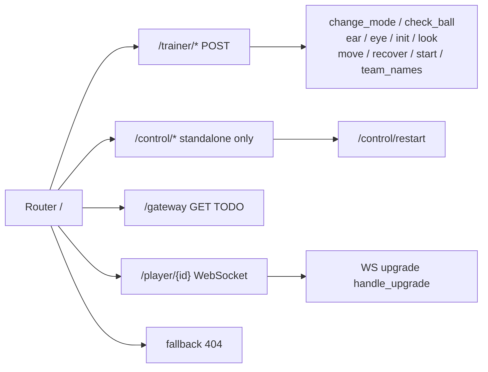
```mermaid
graph LR
    ROOT["Router /"]

    ROOT --> TR["/trainer/* POST"]
    ROOT --> CTRL["/control/* standalone only"]
    ROOT --> GW["/gateway GET TODO"]
    ROOT --> PL["/player/{id} WebSocket"]
    ROOT --> H["fallback 404"]

    TR --> TC["change_mode / check_ball\near / eye / init / look\nmove / recover / start / team_names"]
    CTRL --> RS["/control/restart"]
    PL --> WSP["WS upgrade handle_upgrade"]
```

### 3.2 代理架构

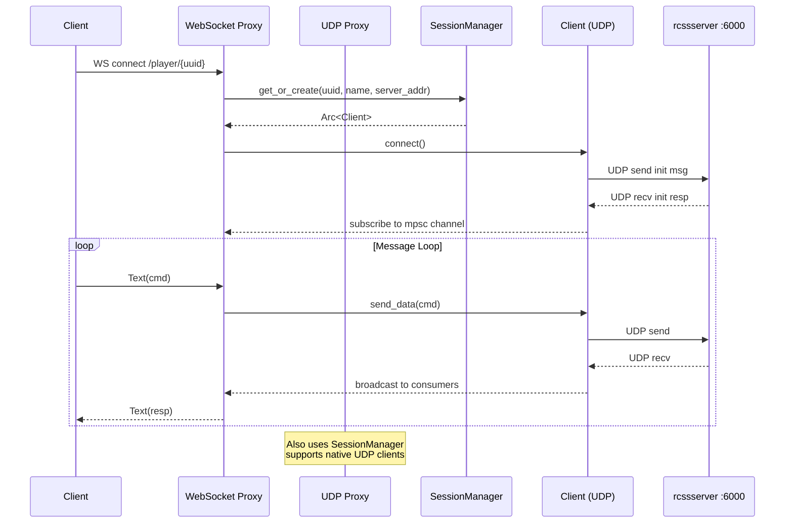
```mermaid
sequenceDiagram
    participant C as Client
    participant WS as WebSocket Proxy
    participant UDP as UDP Proxy
    participant SM as SessionManager
    participant CL as Client (UDP)
    participant RCSS as rcssserver :6000

    C->>WS: WS connect /player/{uuid}
    WS->>SM: get_or_create(uuid, name, server_addr)
    SM-->>WS: Arc<Client>
    WS->>CL: connect()
    CL->>RCSS: UDP send init msg
    RCSS-->>CL: UDP recv init resp
    CL-->>WS: subscribe to mpsc channel

    loop Message Loop
        C->>WS: Text(cmd)
        WS->>CL: send_data(cmd)
        CL->>RCSS: UDP send
        RCSS-->>CL: UDP recv
        CL-->>WS: broadcast to consumers
        WS-->>C: Text(resp)
    end

    Note over UDP: Also uses SessionManager<br/>supports native UDP clients
```

### 3.3 AppState 生命周期

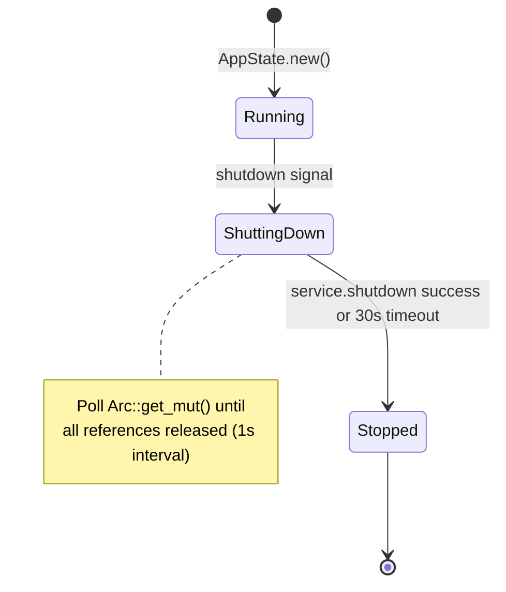
```mermaid
stateDiagram-v2
    [*] --> Running : AppState.new()
    Running --> ShuttingDown : shutdown signal
    ShuttingDown --> Stopped : service.shutdown success or 30s timeout
    Stopped --> [*]

    note right of ShuttingDown
        Poll Arc::get_mut() until
        all references released (1s interval)
    end note
```

---

## 4. Service 层

### 4.1 Service 特性选择

`service` crate 通过 Cargo feature flag 在编译期选择服务类型，两个特性互斥：

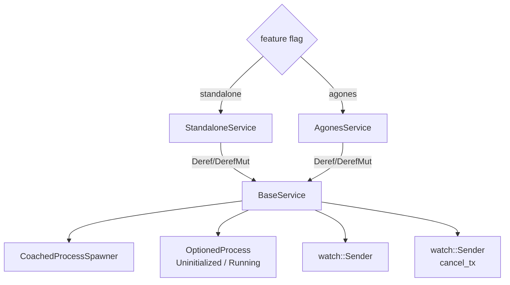
```mermaid
graph TD
    FEAT{feature flag}
    FEAT -->|standalone| SS[StandaloneService]
    FEAT -->|agones| AS[AgonesService]

    SS -->|Deref/DerefMut| BS[BaseService]
    AS -->|Deref/DerefMut| BS

    BS --> SP[CoachedProcessSpawner]
    BS --> PL[OptionedProcess\nUninitialized / Running]
    BS --> ST[watch::Sender<ServerStatus>]
    BS --> CN[watch::Sender<bool>\ncancel_tx]
```

### 4.2 BaseService 内部任务

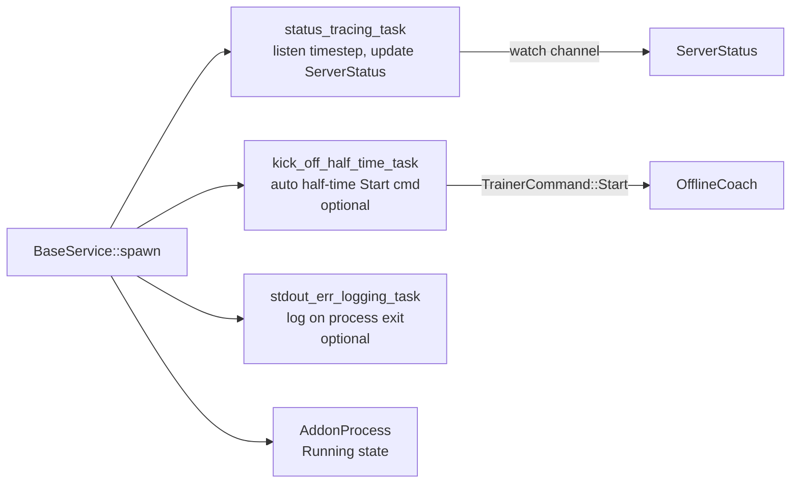
```mermaid
graph LR
    SPAWN[BaseService::spawn]
    SPAWN --> STP[status_tracing_task\nlisten timestep, update ServerStatus]
    SPAWN --> KHT[kick_off_half_time_task\nauto half-time Start cmd\noptional]
    SPAWN --> SLT[stdout_err_logging_task\nlog on process exit\noptional]
    SPAWN --> AP[AddonProcess\nRunning state]

    STP -->|watch channel| ST[ServerStatus]
    KHT -->|TrainerCommand::Start| OC[OfflineCoach]
```

### 4.3 ServerStatus 状态机

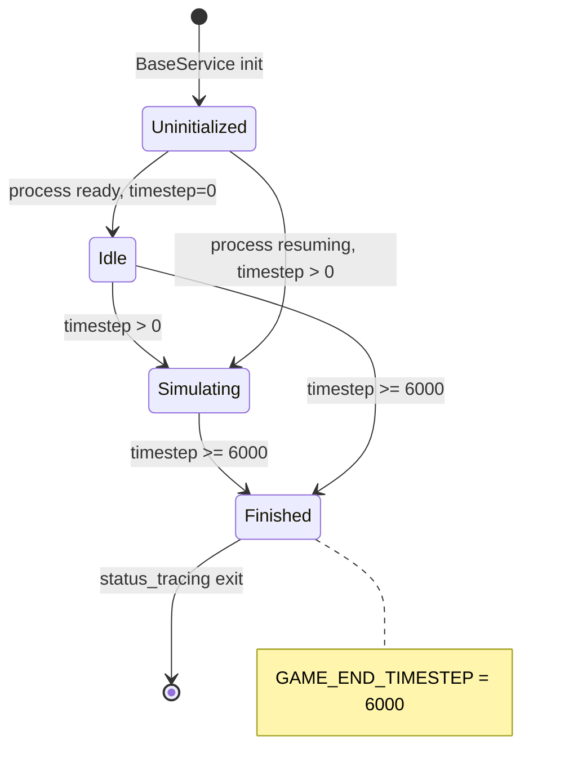
```mermaid
stateDiagram-v2
    [*] --> Uninitialized : BaseService init
    Uninitialized --> Idle : process ready, timestep=0
    Idle --> Simulating : timestep > 0
    Simulating --> Finished : timestep >= 6000
    Idle --> Finished : timestep >= 6000
    Uninitialized --> Simulating : process resuming, timestep > 0
    Finished --> [*] : status_tracing exit

    note right of Finished
        GAME_END_TIMESTEP = 6000
    end note
```

### 4.4 AgonesService 额外能力

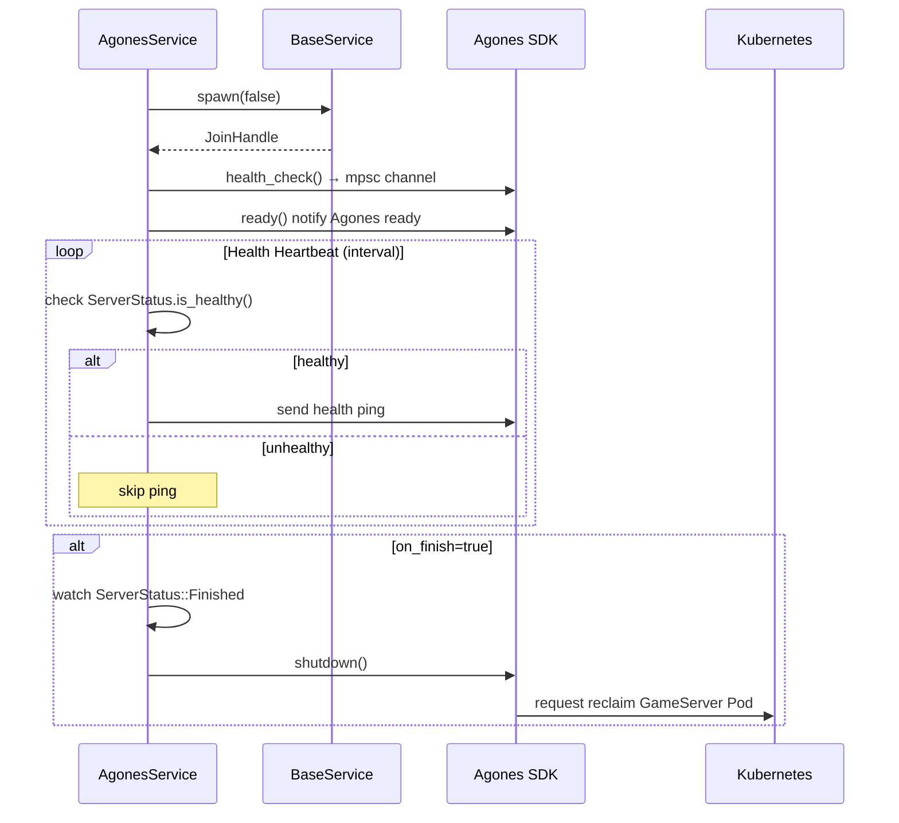
```mermaid
sequenceDiagram
    participant SVC as AgonesService
    participant BS as BaseService
    participant SDK as Agones SDK
    participant K8S as Kubernetes

    SVC->>BS: spawn(false)
    BS-->>SVC: JoinHandle
    SVC->>SDK: health_check() → mpsc channel
    SVC->>SDK: ready() notify Agones ready

    loop Health Heartbeat (interval)
        SVC->>SVC: check ServerStatus.is_healthy()
        alt healthy
            SVC->>SDK: send health ping
        else unhealthy
            Note over SVC: skip ping
        end
    end

    alt on_finish=true
        SVC->>SVC: watch ServerStatus::Finished
        SVC->>SDK: shutdown()
        SDK->>K8S: request reclaim GameServer Pod
    end
```

---

## 5. Process 进程管理

### 5.1 模块结构

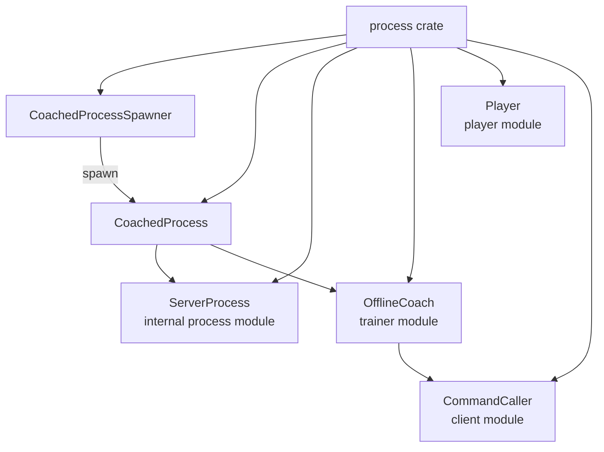
```mermaid
graph TD
    P[process crate]

    P --> CSP[CoachedProcessSpawner]
    P --> CP[CoachedProcess]
    P --> SP[ServerProcess\ninternal process module]
    P --> OC[OfflineCoach\ntrainer module]
    P --> PL[Player\nplayer module]
    P --> CC[CommandCaller<T>\nclient module]

    CSP -->|spawn| CP
    CP --> SP
    CP --> OC
    OC --> CC
```

### 5.2 进程启动时序

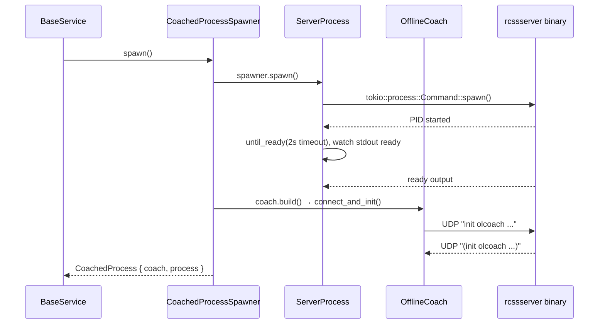
```mermaid
sequenceDiagram
    participant BS as BaseService
    participant CSP as CoachedProcessSpawner
    participant SP as ServerProcess
    participant OC as OfflineCoach
    participant RCSS as rcssserver binary

    BS->>CSP: spawn()
    CSP->>SP: spawner.spawn()
    SP->>RCSS: tokio::process::Command::spawn()
    RCSS-->>SP: PID started
    SP->>SP: until_ready(2s timeout), watch stdout ready
    RCSS-->>SP: ready output
    CSP->>OC: coach.build() → connect_and_init()
    OC->>RCSS: UDP "init olcoach ..."
    RCSS-->>OC: UDP "(init olcoach ...)"
    CSP-->>BS: CoachedProcess { coach, process }
```

### 5.3 CommandCaller 调用链

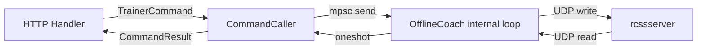
```mermaid
graph LR
    HTTP[HTTP Handler] -->|TrainerCommand| CC[CommandCaller]
    CC -->|mpsc send| OC[OfflineCoach internal loop]
    OC -->|UDP write| RCSS[rcssserver]
    RCSS -->|UDP read| OC
    OC -->|oneshot| CC
    CC -->|CommandResult| HTTP
```

---

## 6. Common 公共库

### 6.1 模块结构

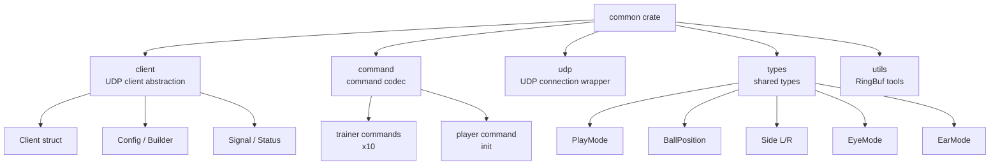
```mermaid
graph TD
    C[common crate]
    C --> CL[client\nUDP client abstraction]
    C --> CMD[command\ncommand codec]
    C --> UDP[udp\nUDP connection wrapper]
    C --> TP[types\nshared types]
    C --> UT[utils\nRingBuf tools]

    CL --> CC[Client struct]
    CL --> CF[Config / Builder]
    CL --> CS[Signal / Status]

    CMD --> TR[trainer commands\nx10]
    CMD --> PL[player command\ninit]

    TP --> PM[PlayMode]
    TP --> BP[BallPosition]
    TP --> SD[Side L/R]
    TP --> EM[EyeMode]
    TP --> EA[EarMode]
```

### 6.2 Client 内部架构

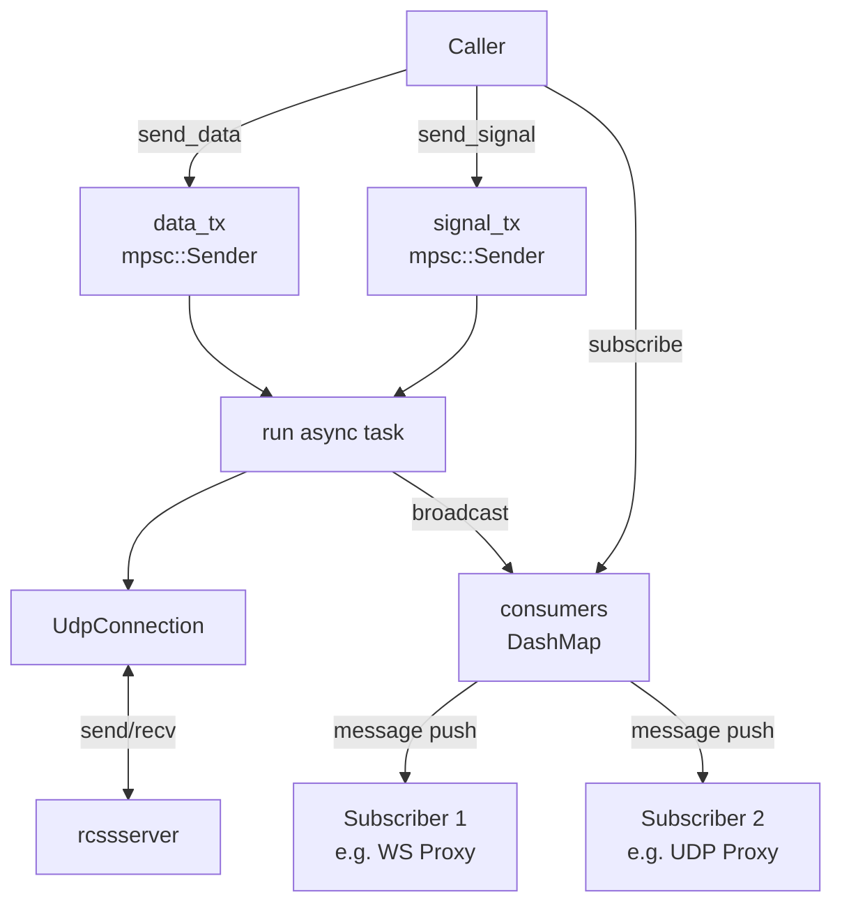
```mermaid
graph TD
    APP[Caller] -->|send_data| DT[data_tx\nmpsc::Sender]
    APP -->|send_signal| ST[signal_tx\nmpsc::Sender]
    APP -->|subscribe| CS[consumers\nDashMap<Uuid, mpsc::Sender>]

    DT --> RUN[run async task]
    ST --> RUN
    RUN --> UDP[UdpConnection]
    UDP <-->|send/recv| RCSS[rcssserver]
    RUN -->|broadcast| CS
    CS -->|message push| SUB1[Subscriber 1\ne.g. WS Proxy]
    CS -->|message push| SUB2[Subscriber 2\ne.g. UDP Proxy]
```

### 6.3 Trainer 命令列表

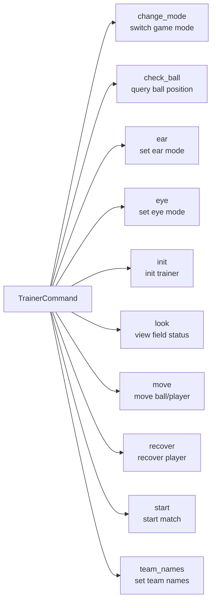
```mermaid
graph LR
    TR[TrainerCommand] --> CM[change_mode\nswitch game mode]
    TR --> CB[check_ball\nquery ball position]
    TR --> EA[ear\nset ear mode]
    TR --> EY[eye\nset eye mode]
    TR --> IN[init\ninit trainer]
    TR --> LK[look\nview field status]
    TR --> MV[move\nmove ball/player]
    TR --> RC[recover\nrecover player]
    TR --> ST[start\nstart match]
    TR --> TN[team_names\nset team names]
```

---

## 7. Match Composer Sidecar

### 7.1 整体架构

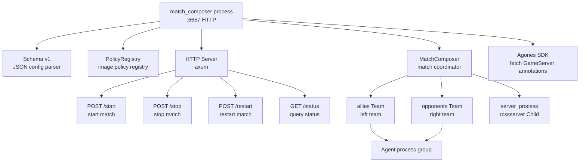
```mermaid
graph TD
    MC[match_composer process\n:6657 HTTP]

    MC --> SCH[Schema v1\nJSON config parser]
    MC --> POL[PolicyRegistry\nimage policy registry]
    MC --> COMP[MatchComposer\nmatch coordinator]
    MC --> SRV[HTTP Server\naxum]
    MC --> AGN[Agones SDK\nfetch GameServer annotations]

    SRV --> R1[POST /start\nstart match]
    SRV --> R2[POST /stop\nstop match]
    SRV --> R3[POST /restart\nrestart match]
    SRV --> R4[GET /status\nquery status]

    COMP --> AL[allies Team\nleft team]
    COMP --> OP[opponents Team\nright team]
    COMP --> SPR[server_process\nrcssserver Child]

    AL --> AGP[Agent process group]
    OP --> AGP
```

### 7.2 Config Schema v1 结构

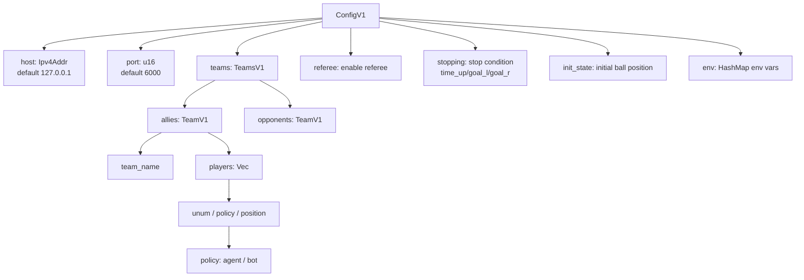
```mermaid
graph TD
    CFG[ConfigV1] --> HOST[host: Ipv4Addr\ndefault 127.0.0.1]
    CFG --> PORT[port: u16\ndefault 6000]
    CFG --> TEAMS[teams: TeamsV1]
    CFG --> REF[referee: enable referee]
    CFG --> STOP[stopping: stop condition\ntime_up/goal_l/goal_r]
    CFG --> INIT[init_state: initial ball position]
    CFG --> ENV[env: HashMap env vars]

    TEAMS --> ALLY[allies: TeamV1]
    TEAMS --> OPP[opponents: TeamV1]

    ALLY --> TN[team_name]
    ALLY --> PLS[players: Vec<PlayerV1>]
    PLS --> PL[unum / policy / position]
    PL --> POL[policy: agent / bot]
```

### 7.3 比赛启动时序

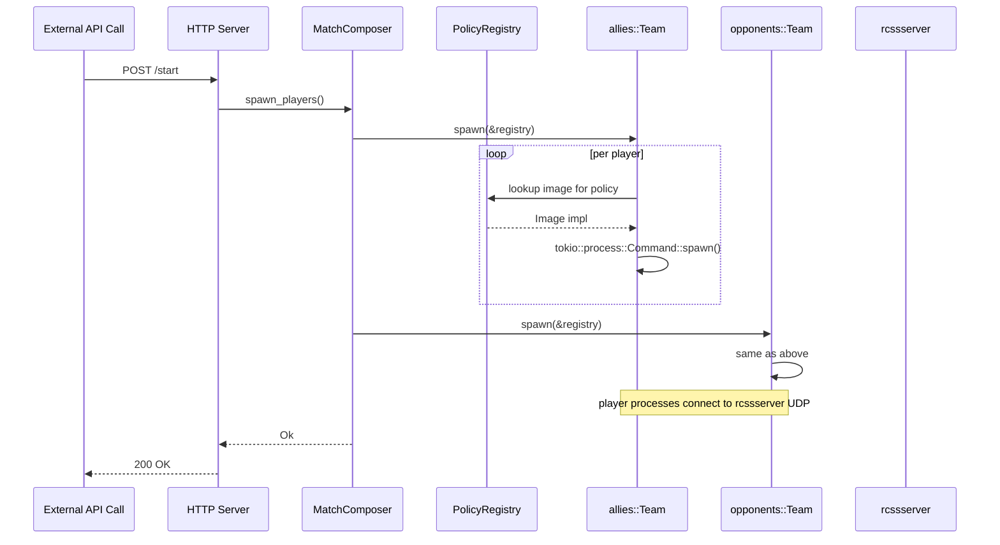
```mermaid
sequenceDiagram
    participant Client as External API Call
    participant Srv as HTTP Server
    participant Comp as MatchComposer
    participant Reg as PolicyRegistry
    participant AT as allies::Team
    participant OT as opponents::Team
    participant RCSS as rcssserver

    Client->>Srv: POST /start
    Srv->>Comp: spawn_players()
    Comp->>AT: spawn(&registry)
    loop per player
        AT->>Reg: lookup image for policy
        Reg-->>AT: Image impl
        AT->>AT: tokio::process::Command::spawn()
    end
    Comp->>OT: spawn(&registry)
    OT->>OT: same as above
    Note over AT,OT: player processes connect to rcssserver UDP
    Comp-->>Srv: Ok
    Srv-->>Client: 200 OK
```

---

## 8. 部署架构（Kubernetes / Agones）

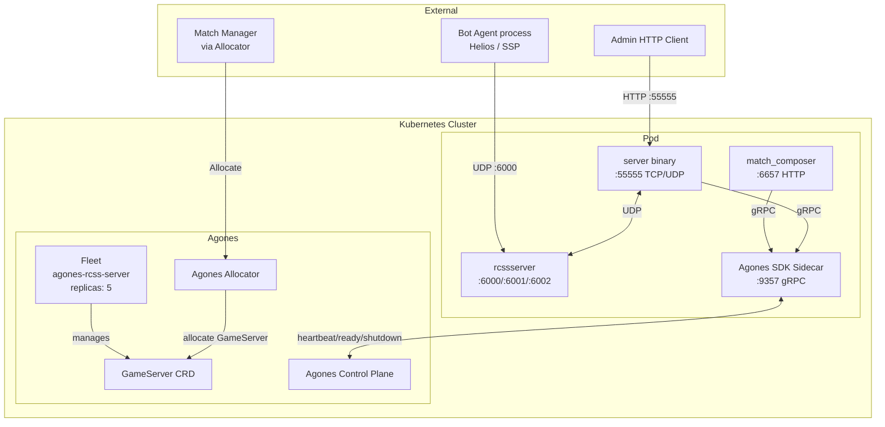
```mermaid
graph TB
    subgraph k8s_cluster["Kubernetes Cluster"]
        subgraph agones_ctrl["Agones"]
            FLEET["Fleet\nagones-rcss-server\nreplicas: 5"]
            GS["GameServer CRD"]
            ALLOC["Agones Allocator"]
            AGONES_CP["Agones Control Plane"]
        end

        subgraph pod_inner["Pod"]
            SERVER["server binary\n:55555 TCP/UDP"]
            SIDECAR["match_composer\n:6657 HTTP"]
            RCSS["rcssserver\n:6000/:6001/:6002"]
            AGONES_SDK["Agones SDK Sidecar\n:9357 gRPC"]
        end

        FLEET -->|manages| GS
        ALLOC -->|allocate GameServer| GS
    end

    subgraph external["External"]
        BOT["Bot Agent process\nHelios / SSP"]
        ADMIN["Admin HTTP Client"]
        MATCHMGR["Match Manager\nvia Allocator"]
    end

    MATCHMGR -->|Allocate| ALLOC
    ADMIN -->|HTTP :55555| SERVER
    BOT -->|UDP :6000| RCSS
    SERVER <-->|UDP| RCSS
    SIDECAR -->|gRPC| AGONES_SDK
    SERVER -->|gRPC| AGONES_SDK
    AGONES_SDK <-->|heartbeat/ready/shutdown| AGONES_CP
```

---

## 9. 综合全图

以下是覆盖整个系统所有关键组件和数据流的综合架构图：

```mermaid
graph TB
    %% ===== External Layer =====
    subgraph ext_clients["External Clients"]
        PC["Player Client\n(UDP / WebSocket)"]
        ADM["Admin\n(HTTP REST)"]
        MATCHMGR["Match Manager\n(Agones Allocator)"]
    end

    %% ===== Server Layer =====
    subgraph server["server crate (:55555)"]
        MAIN["main.rs\nArgs / listen()"]
        APPST["AppState\n{ service, session, status_rx }"]
        SESSMGR["SessionManager\nDashMap<Uuid, Weak<Client>>"]

        subgraph http_routes["HTTP Routes"]
            TR_ROUTE["POST /trainer/*\n(change_mode, start, move...)\nTrainerCommand"]
            CTRL_ROUTE["POST /control/restart\n(standalone only)"]
            GW_ROUTE["GET /gateway\n(TODO)"]
        end

        WS_PROXY["WebSocket Proxy\n/player/{uuid}"]
        UDP_PROXY["UDP Proxy\n:55555 UDP\nSessionInfo + forward_task"]
    end

    %% ===== Service Layer =====
    subgraph service_layer["service crate (feature flag)"]
        SVC_PICK{"feature:\nstandalone | agones"}
        SS["StandaloneService\nspawn / restart"]
        AS["AgonesService\nhealth_check\nshutdown_signal\nready"]
        BS["BaseService\n{ config, spawner, process\n  status_tx, cancel_tx }"]

        subgraph bs_tasks["BaseService Background Tasks"]
            STATUS_TASK["status_tracing_task\ntimestep to ServerStatus"]
            HALFTIME_TASK["kick_off_half_time_task\n(optional) auto half-time kickoff"]
            LOG_TASK["stdout_err_logging_task\n(optional) process log dump"]
        end
    end

    %% ===== Process Layer =====
    subgraph process_layer["process crate"]
        CSP["CoachedProcessSpawner\n{ coach_builder, process_spawner }"]
        CP["CoachedProcess\n{ OfflineCoach, ServerProcess }"]
        OC["OfflineCoach\nUDP :6001\nCommandCaller<TrainerCommand>"]
        SP["ServerProcess\ntokio::process::Child\n+ stdout/stderr RingBuf"]
    end

    %% ===== Common Layer =====
    subgraph common_layer["common crate"]
        CL["Client\n{ config, udp, consumers\n  signal_tx, data_tx }"]
        UDP_CONN["UdpConnection"]
        CONSUMERS["consumers\nDashMap<Uuid, mpsc::Sender>"]
        CMD["Command codec\nTrainer (x10) + Player (init)"]
        TYPES["Types\nPlayMode / BallPosition\nSide / EyeMode / EarMode"]
    end

    %% ===== rcssserver Process =====
    subgraph rcss["rcssserver process"]
        RCSS_PLAYER["player port :6000"]
        RCSS_TRAINER["trainer port :6001"]
        RCSS_COACH["coach port :6002"]
    end

    %% ===== Match Composer Sidecar =====
    subgraph mc["sidecars/match_composer (:6657)"]
        MC_MAIN["main.rs\nread Agones annotations, Config"]
        MC_SRV["HTTP Server\nstart / stop / restart / status"]
        MC_COMP["MatchComposer\n{ config, registry\n  allies, opponents }"]
        MC_TEAM["Team\n{ players, agent_conns }"]
        MC_POL["PolicyRegistry\nimage directory scan"]
        MC_IMG["Image impl\nHeliosBase / SSP / Bot"]
        MC_AGN["Agones SDK\ngRPC :9357"]
    end

    %% ===== Agones / K8s =====
    subgraph k8s["Kubernetes / Agones"]
        AGONES["Agones Control Plane"]
        FLEET["Fleet\n(5 replicas, Packed)"]
        GS_OBJ["GameServer CRD\nrooms Counter\nplayers List"]
    end

    %% ===== Connections =====
    PC -->|"WebSocket"| WS_PROXY
    PC -->|"UDP"| UDP_PROXY
    ADM -->|"HTTP REST"| http_routes
    MATCHMGR -->|"Allocate"| AGONES

    MAIN --> APPST
    APPST --> SESSMGR
    APPST --> http_routes
    APPST --> WS_PROXY
    APPST --> UDP_PROXY

    http_routes -->|"send_trainer_command"| BS
    CTRL_ROUTE -->|"restart"| SS
    WS_PROXY -->|"get_or_create / send_data"| SESSMGR
    UDP_PROXY -->|"get_or_create / send_data"| SESSMGR
    SESSMGR -->|"Arc<Client>"| CL

    SVC_PICK --> SS
    SVC_PICK --> AS
    SS -->|"Deref"| BS
    AS -->|"Deref"| BS
    BS --> CSP
    BS --> bs_tasks
    STATUS_TASK -.->|"watch"| BS
    HALFTIME_TASK -.->|"TrainerCommand::Start"| OC
    LOG_TASK -.->|"watch"| SP

    CSP -->|"spawn()"| CP
    CP --> OC
    CP --> SP
    SP -->|"fork"| rcss

    OC -->|"UDP"| RCSS_TRAINER
    CL --> UDP_CONN
    UDP_CONN -->|"UDP"| RCSS_PLAYER
    CL --> CONSUMERS

    AS -->|"health / ready / shutdown"| MC_AGN
    MC_MAIN --> MC_SRV
    MC_MAIN --> MC_AGN
    MC_SRV --> MC_COMP
    MC_COMP --> MC_TEAM
    MC_TEAM -->|"Image::player_cmd"| MC_IMG
    MC_POL --> MC_IMG
    MC_COMP -.->|"Agent process UDP"| RCSS_PLAYER

    AGONES --> FLEET
    FLEET --> GS_OBJ
    MC_AGN <-->|"gRPC"| AGONES

    %% ===== Styles =====
    classDef external fill:#f9f,stroke:#333
    classDef serverMod fill:#bbf,stroke:#333
    classDef serviceMod fill:#bfb,stroke:#333
    classDef processMod fill:#fbf,stroke:#333
    classDef commonMod fill:#fbb,stroke:#333
    classDef rcssMod fill:#ff9,stroke:#333
    classDef mcMod fill:#bff,stroke:#333
    classDef k8sMod fill:#ddd,stroke:#333

    class PC,ADM,MATCHMGR external
    class MAIN,APPST,SESSMGR,TR_ROUTE,CTRL_ROUTE,GW_ROUTE,WS_PROXY,UDP_PROXY serverMod
    class SVC_PICK,SS,AS,BS,STATUS_TASK,HALFTIME_TASK,LOG_TASK serviceMod
    class CSP,CP,OC,SP processMod
    class CL,UDP_CONN,CONSUMERS,CMD,TYPES commonMod
    class RCSS_PLAYER,RCSS_TRAINER,RCSS_COACH rcssMod
    class MC_MAIN,MC_SRV,MC_COMP,MC_TEAM,MC_POL,MC_IMG,MC_AGN mcMod
    class AGONES,FLEET,GS_OBJ k8sMod
```

---

## 关键设计亮点

| 设计点 | 说明 |
|---|---|
| **Feature Flag 部署模式** | `standalone` / `agones` 编译期互斥，单二进制适配本地和 K8s 环境 |
| **Pub/Sub Client** | `common::Client` 通过 `DashMap<Uuid, mpsc::Sender>` 实现多订阅者，WS 代理和 UDP 代理共享同一 UDP 连接 |
| **SessionManager** | 用 `Weak<Client>` 存储会话，客户端断开后自动 GC，避免内存泄漏 |
| **Watch Channel 状态机** | `ServerStatus` 通过 `tokio::sync::watch` 广播，驱动 Agones 健康检查和自动关机 |
| **优雅关机** | `AppState` 通过 `oneshot + watch` 链实现：HTTP 服务停止 → Service shutdown → Agones SDK shutdown |
| **Match Composer** | 作为 Sidecar 运行，从 Agones GameServer 注解读取配置，自动拉起双队球员进程 |
