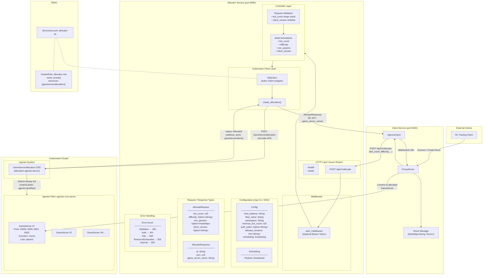
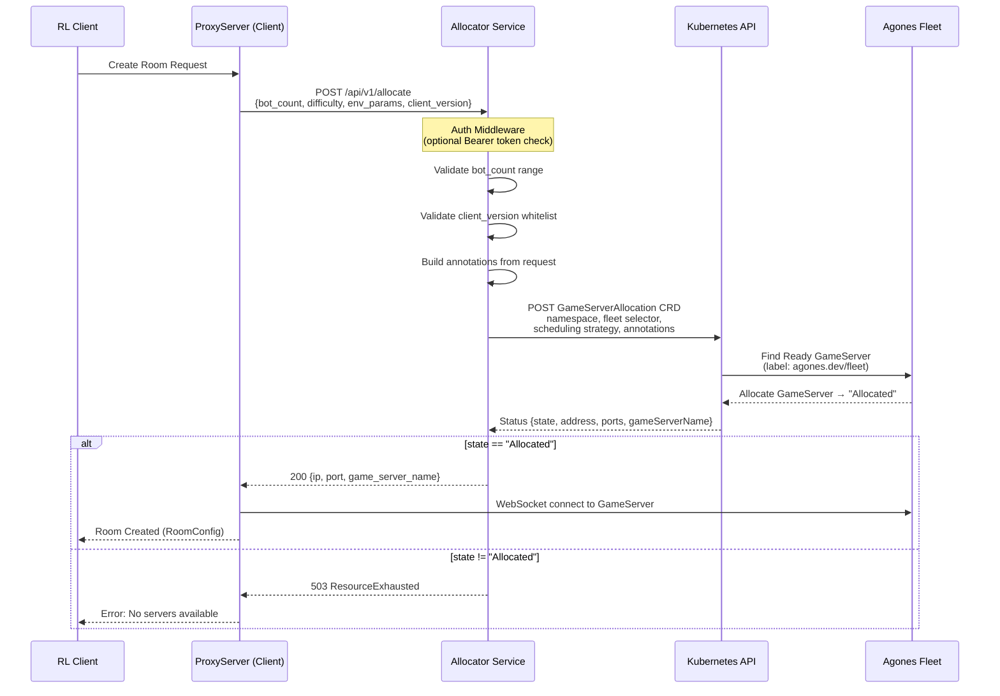
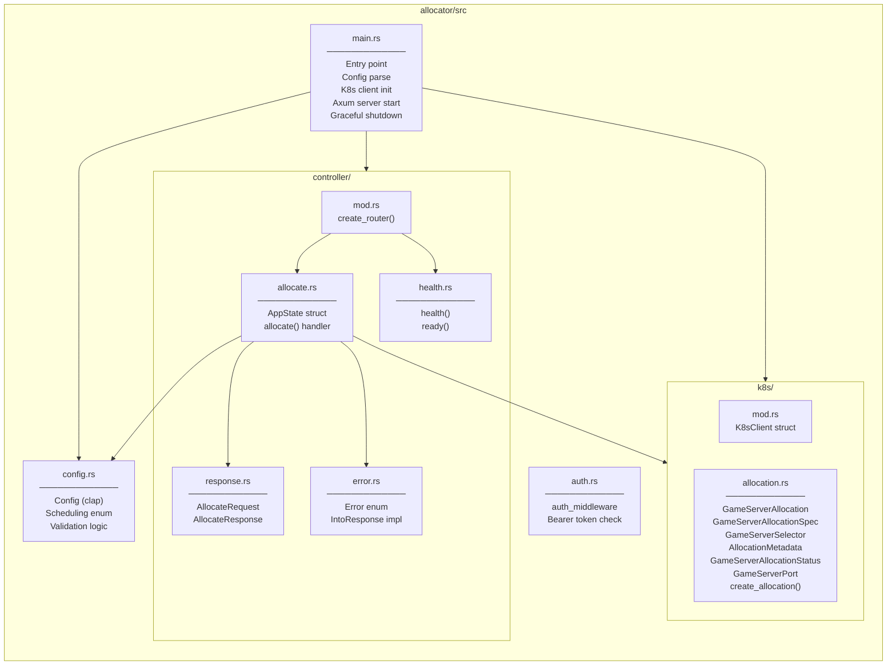
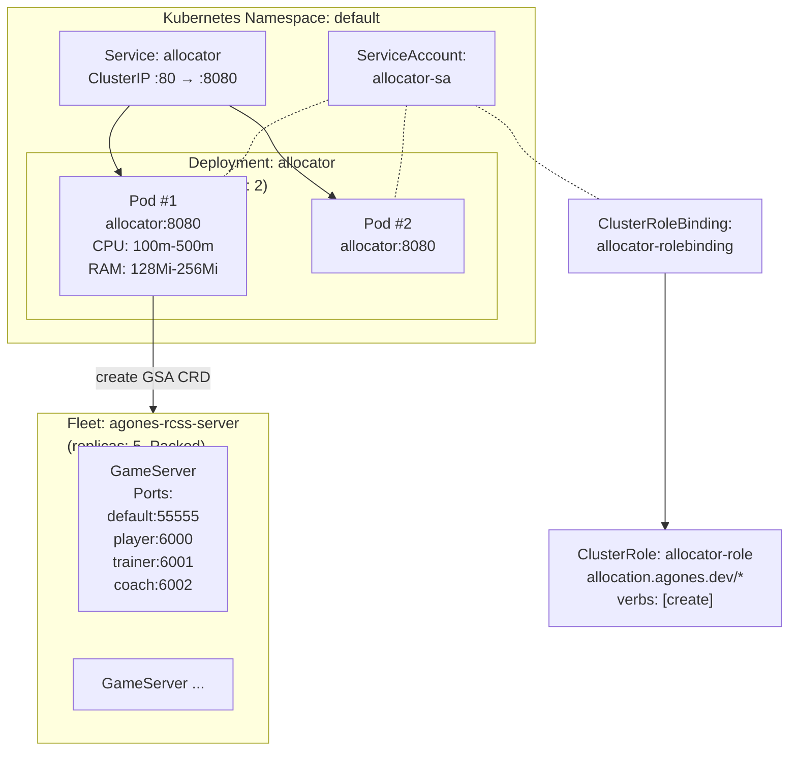

# Allocator Architecture

## Overview

The **Allocator** is a custom Agones GameServer allocator service built with Axum (Rust). It receives allocation requests from the **Client** (proxy), validates them, and creates `GameServerAllocation` CRDs in Kubernetes to claim a ready GameServer from an Agones Fleet.

## Architecture Diagram

## Allocation Flow (Sequence)

## Module Structure

## Kubernetes Deployment Topology

## Key Design Notes

1. **Scheduling Strategies**: Supports `Packed` (fill existing nodes first) and `Distributed` (spread across nodes) via Agones scheduling.
2. **Fleet Selector**: Allocation targets GameServers by label `agones.dev/fleet: <fleet_name>`.
3. **Annotations Passthrough**: Client parameters (`bot_count`, `difficulty`, `env_params`, `client_version`) are passed as annotations on the `GameServerAllocation` metadata for the GameServer to consume.
4. **Auth is Optional**: Bearer token authentication can be enabled via `AUTH_TOKEN` env var; when unset, all requests are allowed.
5. **Version Gating**: `ALLOWED_VERSIONS` enables restricting which client versions can allocate servers.
6. **GameServer Ports**: Each allocated GameServer exposes 4 ports — `default` (HTTP API:55555), `player` (client proxy:6000), `trainer` (6001), and `coach` (6002).
7. **Resource Tracking**: Fleet uses Agones counters (`rooms`) and lists (`players`) for priority-based allocation.
