# Match Composer — 设计文档

> **模块路径**: `sidecars/match_composer`
> **版本**: 0.1.0 &nbsp;|&nbsp; **语言**: Rust (Edition 2024)
> **作者**: EnricLiu

---

## 目录

1. [概述与定位](#1-概述与定位)
2. [系统全局视角](#2-系统全局视角)
3. [核心架构](#3-核心架构)
4. [模块结构](#4-模块结构)
5. [配置系统三层架构](#5-配置系统三层架构)
6. [Image & Policy 子系统](#6-image--policy-子系统)
7. [比赛生命周期](#7-比赛生命周期)
8. [HTTP API 参考](#8-http-api-参考)
9. [部署模型](#9-部署模型)
10. [关键设计决策](#10-关键设计决策)

---

## 1. 概述与定位

### 1.1 是什么

**Match Composer** 是 `rcss_cluster` 系统中的 **Sidecar 服务**，以独立进程的形式运行在与 rcssserver 相同的 Pod 内。它负责一场 RoboCup Soccer 仿真比赛的 **编排（Orchestration）**：根据声明式配置自动拉起双方球员进程，管理它们的生命周期，并通过 HTTP API 对外暴露比赛控制能力。

### 1.2 解决什么问题

在传统 RoboCup 仿真对抗中，启动一场比赛需要手动：

1. 启动 rcssserver
2. 为左右两队分别启动 11 个球员进程，每个球员需要正确的参数（队名、号码、守门员标识、服务器地址等）
3. 对 Agent 类型球员还需要额外配置 gRPC 连接信息
4. 管理所有进程的生命周期与日志

**Match Composer 将上述操作自动化**：接收一份 JSON 配置，自动完成球员进程的批量启动、状态监控和优雅关闭。

### 1.3 在 rcss_cluster 中的定位

```
rcss_cluster 是一个多组件系统：

  ┌─ client    → API 网关，面向用户路由请求
  ├─ server    → 后端服务，控制 rcssserver 实例
  ├─ service   → 部署抽象层（standalone / agones）
  ├─ process   → rcssserver 进程管理
  ├─ common    → 共享类型和工具库
  └─ sidecars/
      └─ match_composer  ← 本文档所述组件
```

Match Composer 是系统中唯一的 **Sidecar 组件**，不直接参与用户请求链路，而是作为 Kubernetes Pod 内的 **辅助容器**，专注于比赛编排。

---

## 2. 系统全局视角

### 2.1 Kubernetes Pod 内部视角

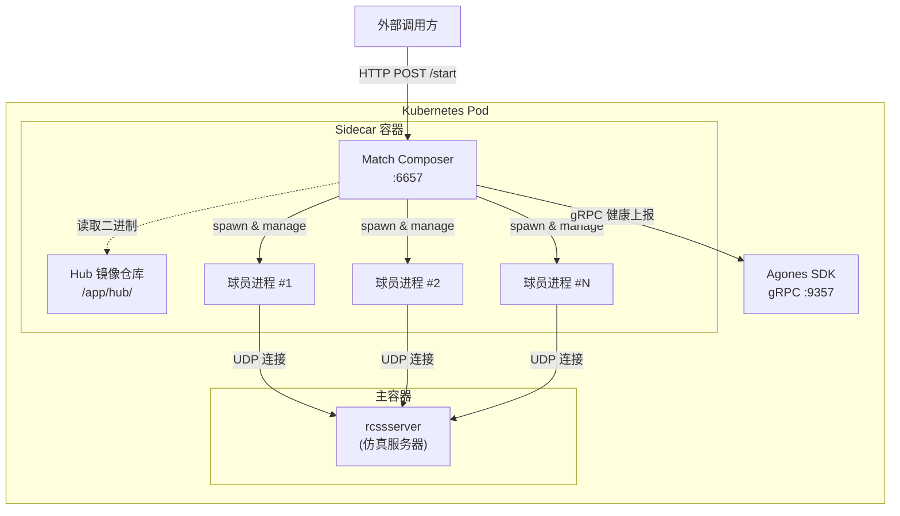

### 2.2 数据流全景

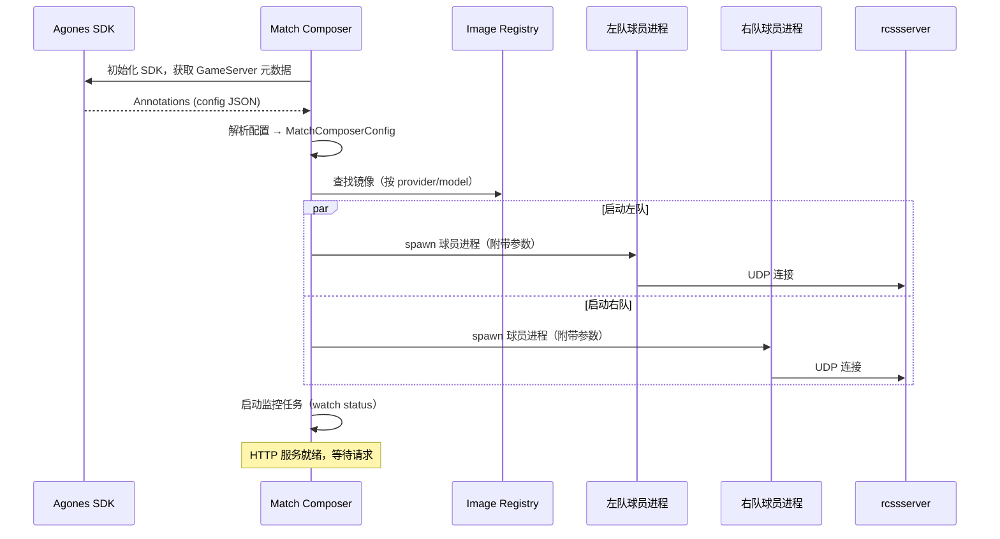

---

## 3. 核心架构

### 3.1 分层架构图

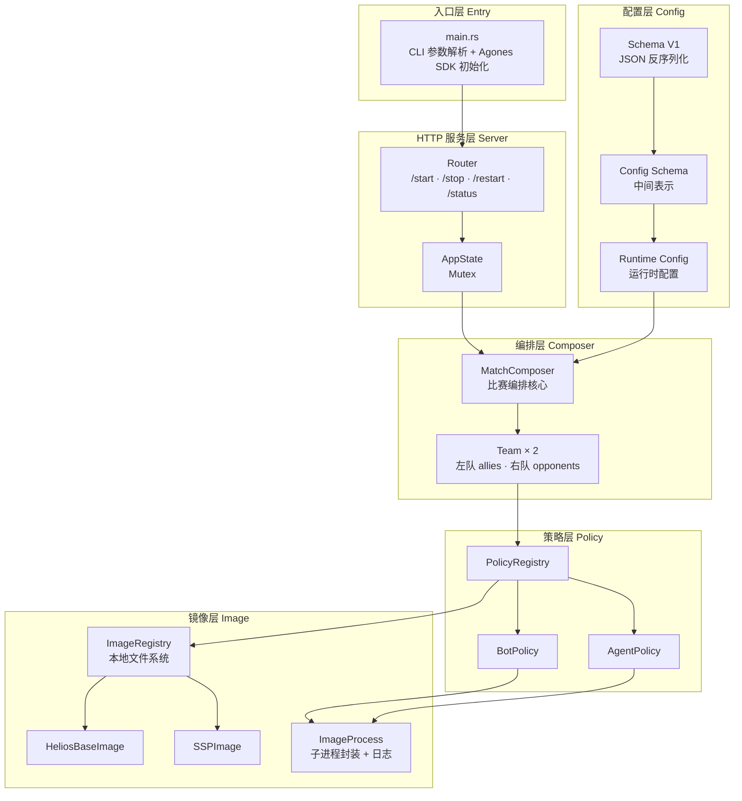

### 3.2 设计哲学

| 原则 | 体现 |
|------|------|
| **声明式配置** | 用户只需提交一份 JSON，Match Composer 自动编排整场比赛 |
| **关注点分离** | Schema 解析 → Config 转换 → Runtime 使用，三层独立演进 |
| **多态策略** | Bot 和 Agent 两种球员类型通过 Policy trait 统一抽象 |
| **镜像解耦** | 球员二进制通过 Image trait 加载，新 AI 框架只需实现该 trait |
| **生命周期管理** | 每个进程由 `ImageProcess` 封装，支持状态订阅与优雅关闭 |

---

## 4. 模块结构

### 4.1 源码目录树

```
sidecars/match_composer/
├── Cargo.toml                  # 包定义 & 依赖
├── Dockerfile                  # 多阶段构建（C++ 依赖 + Rust 二进制）
├── docs/
│   ├── template.json           # 配置示例
│   └── DESIGN.md               # 本文档
├── hub/                        # 镜像仓库（球员二进制 + 启动脚本）
│   ├── Cyrus2D/
│   │   └── SoccerSimulationProxy/
│   │       └── start_player.sh
│   └── HELIOS/
│       └── helios-base/
│           └── start_player.sh
└── src/
    ├── main.rs                 # 入口：CLI + Agones 初始化
    ├── agones.rs               # Agones SDK 封装 & 配置提取
    ├── composer.rs             # MatchComposer 核心编排
    ├── team.rs                 # Team 管理 & 状态机
    ├── schema/                 # JSON 配置 Schema 定义（V1）
    │   ├── mod.rs
    │   └── v1/
    │       ├── config.rs       #   ConfigV1（顶层配置）
    │       ├── team/           #   队伍 Schema
    │       ├── player.rs       #   球员 Schema
    │       ├── policy.rs       #   策略 Schema（Bot / Agent）
    │       ├── agent.rs        #   Agent 变体（SSP 等）
    │       ├── position.rs     #   坐标类型
    │       └── utils.rs        #   校验工具
    ├── config/                 # 配置转换层
    │   ├── schema/             #   Schema → 中间表示
    │   │   ├── player.rs
    │   │   └── team.rs
    │   └── runtime/            #   中间表示 → 运行时配置
    │       ├── composer.rs     #     MatchComposerConfig
    │       ├── team.rs         #     TeamConfig
    │       ├── player.rs       #     PlayerConfig（Bot / Agent）
    │       ├── bot.rs          #     BotConfig
    │       ├── agent.rs        #     AgentConfig
    │       ├── server.rs       #     ServerConfig
    │       └── image.rs        #     ImageConfig / ImageMeta
    ├── policy/                 # 策略层：配置 + 镜像 → 可执行策略
    │   ├── policy.rs           #   Policy<Cfg> 泛型结构
    │   ├── bot.rs              #   BotPolicy
    │   ├── agent.rs            #   AgentPolicy
    │   └── registry.rs         #   PolicyRegistry
    ├── image/                  # 镜像层：二进制加载 & 进程管理
    │   ├── image.rs            #   Image trait
    │   ├── registry.rs         #   ImageRegistry（文件系统扫描）
    │   ├── helios_base.rs      #   HeliosBaseImage 实现
    │   ├── ssp.rs              #   SSPImage 实现
    │   └── process.rs          #   ImageProcess（子进程 + 日志）
    └── server/                 # HTTP 服务层
        ├── mod.rs              #   AppState + listen()
        ├── error.rs            #   Error 类型
        ├── response.rs         #   响应 DTO
        └── routes/
            ├── start.rs        #   POST /start
            ├── stop.rs         #   POST /stop
            ├── restart.rs      #   POST /restart
            └── status.rs       #   GET  /status
```

### 4.2 模块依赖关系

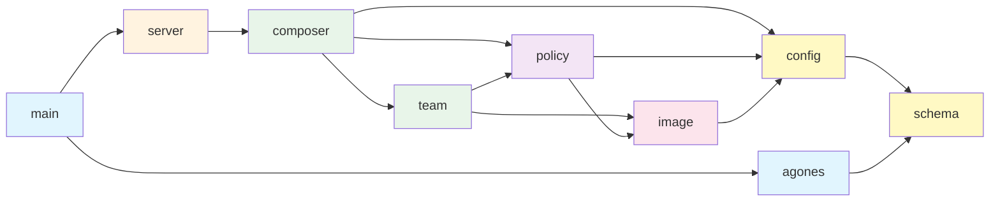

---

## 5. 配置系统三层架构

Match Composer 的配置系统采用 **三层转换管线**，将外部 JSON 输入逐步转化为类型安全的运行时配置。

### 5.1 三层总览

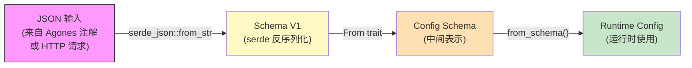

| 层级 | 模块 | 职责 |
|------|------|------|
| **Schema V1** | `src/schema/v1/` | JSON 反序列化，字段校验（`Schema::verify()`），用户友好的默认值 |
| **Config Schema** | `src/config/schema/` | 从 Schema 剥离 UI 关注点，提取核心字段（Team、Player、Policy） |
| **Runtime Config** | `src/config/runtime/` | 注入运行时上下文（Side、ServerConfig、日志路径），生成最终可用配置 |

### 5.2 Schema V1 层

`ConfigV1` 是面向用户的顶层配置结构：

```
ConfigV1
├── host: Ipv4Addr           (默认 127.0.0.1)
├── port: u16                 (默认 6000)
├── teams: TeamsV1
│   ├── allies: TeamV1        (默认 side = Left)
│   │   ├── name: String
│   │   ├── side: TeamSideV1
│   │   └── players: Vec<PlayerV1>
│   │       ├── unum: u8
│   │       ├── goalie: bool
│   │       ├── policy: PolicyV1
│   │       │   ├── Bot { image }
│   │       │   └── Agent(AgentV1)
│   │       │       └── SSP { image, grpc_host, grpc_port }
│   │       ├── init_state: PlayerInitStateV1
│   │       └── blocklist: PlayerActionList
│   └── opponents: TeamV1     (默认 side = Right)
├── referee: RefereeV1
├── stopping: StoppingEventV1
├── init_state: GlobalInitStateV1
└── env: Option<HashMap<String, String>>
```

**校验规则**（`Schema::verify()`）：
- 两队不能在同一边（side 不能相同）
- 两队不能同名
- 队名 ASCII 限制，长度 ≤ 16
- 球员号码 1–12，每队最多 11 人
- 初始位置必须在合法范围 `[0, 1] × [0, 1]` 内

### 5.3 Config Schema 层（中间表示）

```rust
TeamSchema   { name, players: Vec<PlayerSchema> }
PlayerSchema { unum, goalie, policy: PlayerPolicySchema }
PlayerPolicySchema::Bot   { image }
PlayerPolicySchema::Agent { image, grpc_host, grpc_port }
```

通过 `From<TeamV1>` 和 `From<PlayerV1>` 自动转换，剥离了 `init_state`、`blocklist` 等对进程编排不必要的字段。

### 5.4 Runtime Config 层

```rust
MatchComposerConfig { server, log_root, allies: TeamConfig, opponents: TeamConfig }
TeamConfig          { name, side: Side, players: Vec<PlayerConfig> }
PlayerConfig::Bot   (BotConfig   { unum, side, team, goalie, image, server, log_root })
PlayerConfig::Agent (AgentConfig { unum, side, team, goalie, image, server, grpc, log_root })
```

`from_schema()` 方法在此阶段注入：
- `Side`（LEFT / RIGHT）
- `ServerConfig`（rcssserver 地址）
- 日志根目录（按时间戳子目录分 allies/opponents）

---

## 6. Image & Policy 子系统

### 6.1 Image 抽象

`Image` trait 是所有球员二进制镜像的统一接口：

```rust
pub trait Image: Send + Sync {
    fn meta(&self) -> &ImageMeta;       // 元信息（provider, model, path）
    fn cmd(&self) -> Command;           // 基础启动命令
    fn player_cmd(&self, config: &PlayerProcessConfig) -> Command;  // 完整球员启动命令
}
```

当前实现：

| 实现 | Provider | Model | 说明 |
|------|----------|-------|------|
| `HeliosBaseImage` | HELIOS | helios-base | 传统 C++ 球员，完整实现 `player_cmd()` |
| `SSPImage` | Cyrus2D | SoccerSimulationProxy | gRPC 代理球员，使用 `cmd()` + 手动参数 |

### 6.2 ImageRegistry

`ImageRegistry` 基于 **本地文件系统** 管理镜像：

```
hub/                          ← registry 根目录
├── Cyrus2D/                  ← provider
│   └── SoccerSimulationProxy/ ← model
│       ├── start_player.sh
│       ├── sample_player     (编译后的二进制)
│       ├── player.conf
│       └── formations-dt/
└── HELIOS/                   ← provider
    └── helios-base/           ← model
        ├── start_player.sh
        ├── sample_player
        ├── player.conf
        └── formations-dt/
```

镜像查找流程：

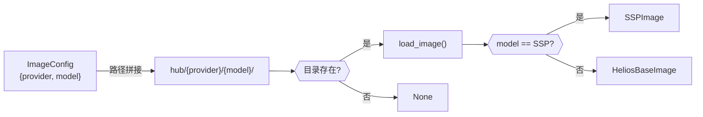

### 6.3 Policy = Config + Image

`Policy<Cfg>` 是一个泛型结构，将 **配置** 与 **镜像** 绑定：

```rust
pub struct Policy<Cfg: Debug> {
    pub cfg: Cfg,
    pub image: Box<dyn Image>,
}
```

| 类型别名 | Cfg 类型 | 职责 |
|----------|---------|------|
| `BotPolicy` = `Policy<BotConfig>` | `BotConfig` | 调用 `image.player_cmd()` 启动传统球员 |
| `AgentPolicy` = `Policy<AgentConfig>` | `AgentConfig` | 调用 `image.cmd()` + 手动添加 gRPC 参数 |

### 6.4 PolicyRegistry

`PolicyRegistry` 将运行时配置转换为可 spawn 的策略对象：

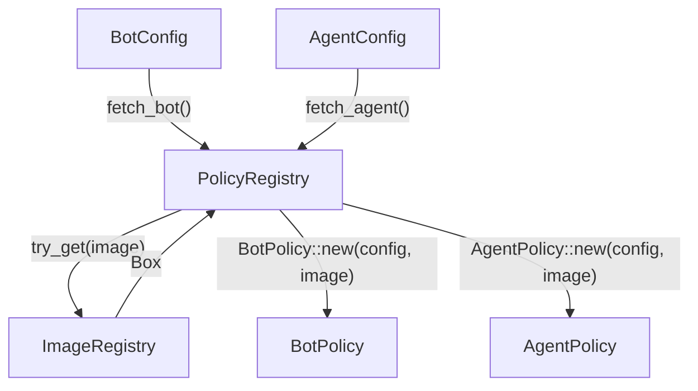

---

## 7. 比赛生命周期

### 7.1 状态机

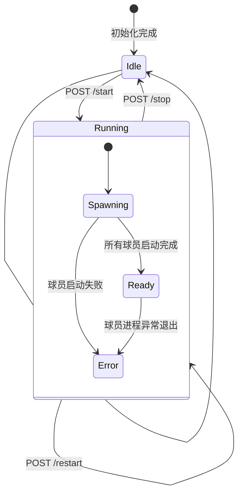

### 7.2 Team 内部状态机

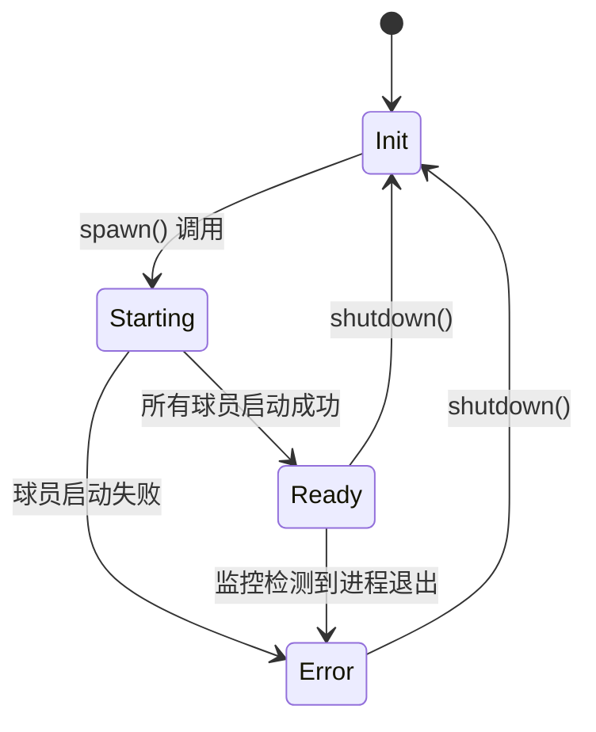

每个 `Team` 通过 `tokio::sync::watch` 广播状态变更，`MatchComposer` 通过 `team.wait()` 等待两队就绪。

### 7.3 球员启动流程

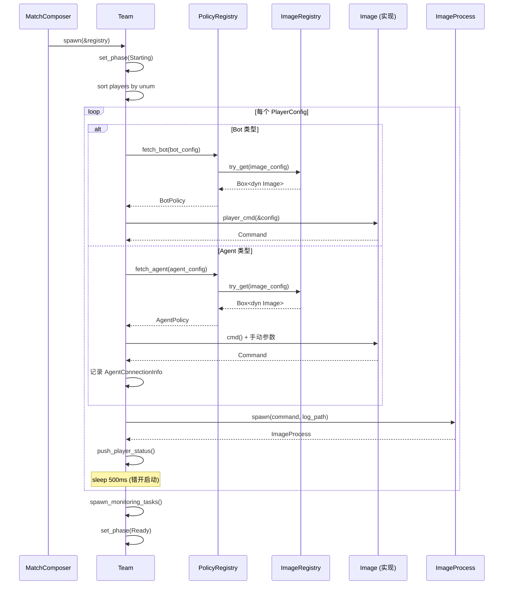

### 7.4 进程监控

每个 `ImageProcess` 内部包含一个 `Process`（来自 `common` crate），通过 `watch::channel` 广播进程状态。

`Team::spawn_monitoring_tasks()` 为每个球员进程生成一个 tokio 任务：

```rust
// 伪代码
tokio::spawn(async move {
    loop {
        watch.changed().await;          // 等待进程状态变更
        let status = watch.borrow();
        update_team_status(idx, status);
        if status.is_finished() {
            set_phase(Error(...));      // 任何球员退出 → 标记为错误
            return;
        }
    }
});
```

### 7.5 优雅关闭

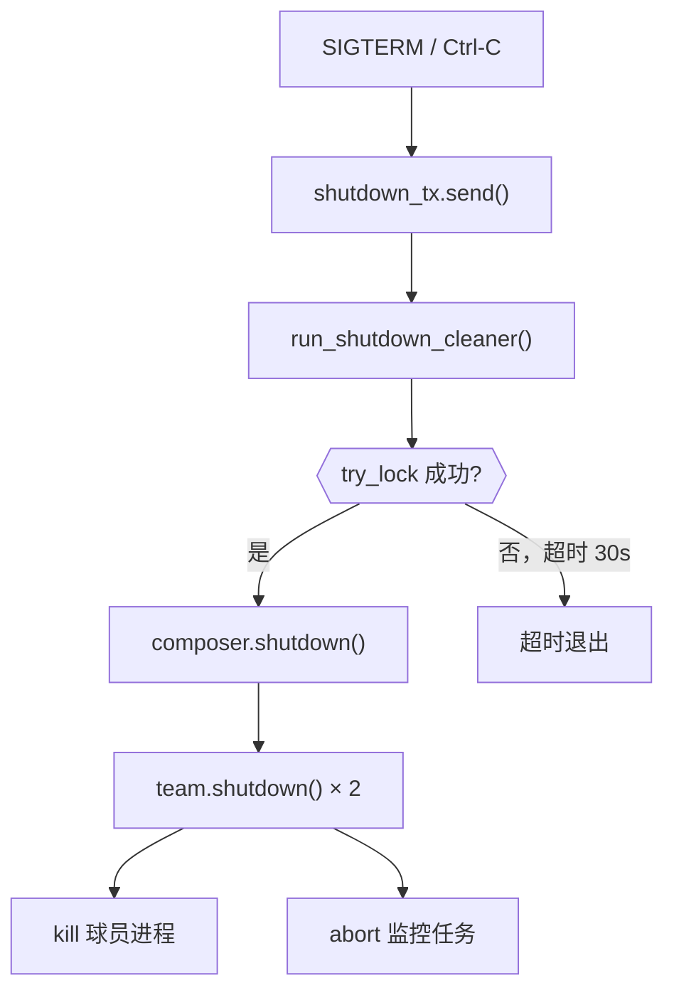

AppState 在初始化时注册 `oneshot::Receiver<()>`，收到关闭信号后：
1. 每 1 秒尝试获取 Mutex 锁
2. 成功后调用 `composer.shutdown()`
3. 超时 30 秒后强制退出

---

## 8. HTTP API 参考

Match Composer 通过 Axum 框架提供 HTTP API，默认监听 `0.0.0.0:6657`。

### 8.1 端点一览

| 方法 | 路径 | 说明 | 请求体 | 响应 |
|------|------|------|--------|------|
| `POST` | `/start` | 启动比赛 | `ConfigV1` (可选) | `StartResponse` |
| `POST` | `/stop` | 停止比赛 | 无 | `MessageResponse` |
| `POST` | `/restart` | 重启比赛 | `ConfigV1` (可选) | `StartResponse` |
| `GET` | `/status` | 查询状态 | 无 | `StatusResponse` |

### 8.2 POST /start

启动一场新比赛。如果当前已有比赛在运行，返回 **409 Conflict**。

**请求体**（可选，不传则使用上次的配置）：

```json
{
  "host": "127.0.0.1",
  "port": 6000,
  "teams": {
    "allies": {
      "name": "SSP",
      "players": [
        {
          "unum": 1,
          "goalie": true,
          "policy": {
            "kind": "agent",
            "agent": "ssp",
            "image": "Cyrus2D/SoccerSimulationProxy",
            "grpc_host": "127.0.0.1",
            "grpc_port": 6657
          }
        }
      ]
    },
    "opponents": {
      "name": "HB",
      "players": [
        {
          "unum": 1,
          "goalie": true,
          "policy": {
            "kind": "bot",
            "image": "HELIOS/helios-base"
          }
        }
      ]
    }
  }
}
```

**响应** `200 OK`：

```json
{
  "agents": [
    {
      "side": "LEFT",
      "unum": 1,
      "team_name": "SSP",
      "grpc_host": "127.0.0.1",
      "grpc_port": 6657
    }
  ]
}
```

### 8.3 POST /stop

停止当前运行的比赛，关闭所有球员进程。

**响应** `200 OK`：

```json
{ "message": "Composer stopped." }
```

### 8.4 POST /restart

先停止（如果在运行），然后以新配置（或上次配置）重新启动。响应格式同 `/start`。

### 8.5 GET /status

返回当前状态和 Agent 连接信息。

**Idle 状态**：

```json
{ "state": "idle" }
```

**Running 状态**：

```json
{
  "state": "running",
  "agents": [
    {
      "side": "LEFT",
      "unum": 1,
      "team_name": "SSP",
      "grpc_host": "127.0.0.1",
      "grpc_port": 6657
    }
  ],
  "started_at": "2025-01-15T10:30:00Z"
}
```

### 8.6 错误响应

所有错误统一返回：

```json
{ "error": "<错误描述>" }
```

| HTTP 状态码 | 含义 |
|------------|------|
| 400 | 请求参数无效或状态不允许 |
| 409 | 冲突（如比赛已在运行时调用 /start） |
| 500 | 内部错误（进程启动失败等） |

---

## 9. 部署模型

### 9.1 Agones Sidecar 模式

Match Composer 设计为 Agones GameServer 的 **Sidecar 容器**，运行在同一 Pod 中：

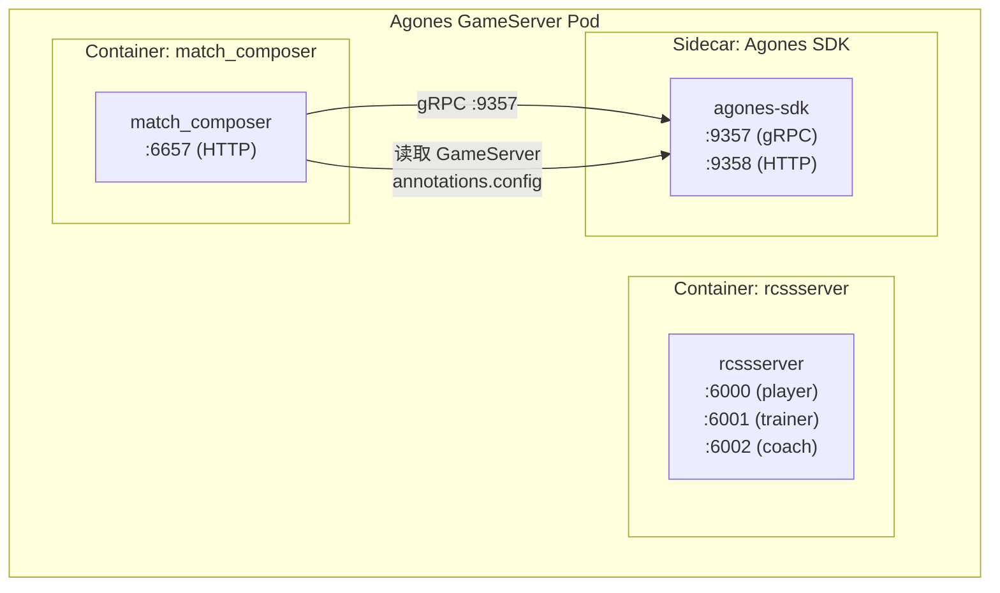

**配置传递路径**：

1. 在 GameServer YAML 中通过 `metadata.annotations.config` 传入 JSON 配置
2. Match Composer 启动时通过 Agones SDK gRPC 获取 GameServer 对象
3. 从 annotations 中提取并解析 `ConfigV1`
4. 自动启动比赛

### 9.2 Docker 多阶段构建

Dockerfile 采用 **5 阶段构建**，最终镜像约束在 Debian 12 slim 基础上：

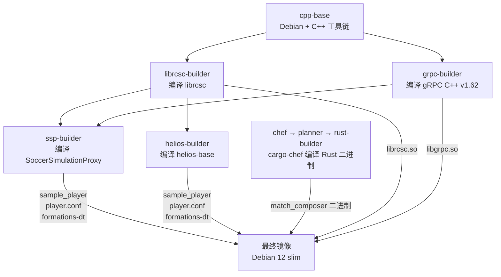

**最终镜像目录结构**：

```
/app/
├── match_composer              # Rust 二进制
├── hub/
│   ├── Cyrus2D/
│   │   └── SoccerSimulationProxy/
│   │       ├── start_player.sh
│   │       ├── sample_player
│   │       ├── player.conf
│   │       └── formations-dt/
│   └── HELIOS/
│       └── helios-base/
│           ├── start_player.sh
│           ├── sample_player
│           ├── player.conf
│           └── formations-dt/
└── logs/                       # 运行时日志输出目录
```

### 9.3 环境变量

| 变量 | 默认值 | 说明 |
|------|--------|------|
| `HOST` | `0.0.0.0` | HTTP 监听地址 |
| `PORT` | `6657` | HTTP 监听端口 |
| `HUB_PATH` | `/app/hub` | 镜像仓库路径 |
| `LOG_ROOT` | `/app/logs` | 日志根目录 |
| `AGONES_GRPC_PORT` | `9357` | Agones SDK gRPC 端口 |
| `AGONES_KEEP_ALIVE` | `30` | Agones 心跳间隔（秒） |

---

## 10. 关键设计决策

### 10.1 为何采用 Sidecar 模式而非独立服务？

**决策**：Match Composer 以 Sidecar 容器形式运行在 GameServer Pod 内。

**原因**：
- 球员进程需要通过 **localhost UDP** 连接 rcssserver，Sidecar 共享网络命名空间
- 与 GameServer 绑定的 1:1 生命周期
- 自然适配 Agones 的 GameServer 分配模型

### 10.2 为何配置系统分三层？

**决策**：Schema V1 → Config Schema → Runtime Config 三层转换。

**原因**：
- **Schema 层**面向用户，需要友好的默认值和灵活的 serde 配置
- **Config Schema 层**是解耦桥梁，隔离 Schema 变更对运行时的影响（未来可支持 V2）
- **Runtime Config 层**注入运行时上下文（Side、日志路径），提供类型安全的最终配置

### 10.3 为何使用 `watch` 而非 `mpsc` 进行状态广播？

**决策**：`tokio::sync::watch` 用于进程状态和 Team 状态通知。

**原因**：
- `watch` 是 **单生产者多消费者** 模型，天然适合 "一个进程，多个监听者" 场景
- 消费者始终获取 **最新值**，不会积压历史状态
- `wait_for()` 允许条件等待，简化 "等待就绪" 逻辑

### 10.4 球员启动时的 500ms 延迟

**决策**：每个球员进程启动后 sleep 500ms。

**原因**：
- rcssserver 的 UDP 连接有序列化要求，球员需要按号码顺序注册
- 错开启动避免端口竞争和连接冲突

### 10.5 镜像加载的 "约定优于配置"

**决策**：`ImageRegistry` 通过目录名约定（`{provider}/{model}/`）查找镜像，通过模型名硬编码加载对应实现。

**原因**：
- 当前只有两种镜像类型（HeliosBase、SSP），简单的 if-else 足够
- 文件系统作为镜像仓库避免了引入额外的注册中心依赖
- 未来可演进为插件式加载或配置文件驱动
